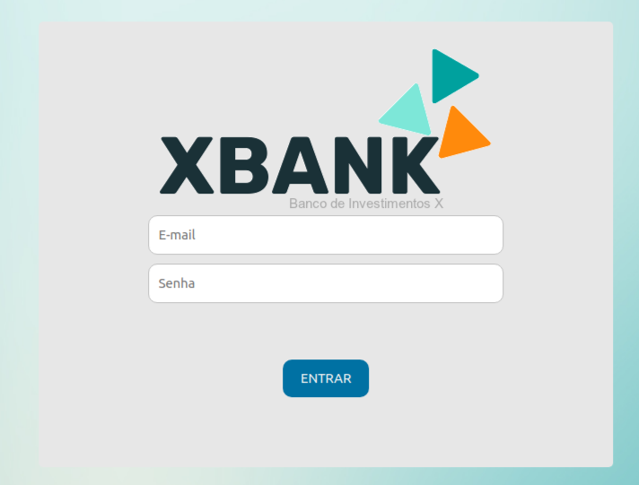
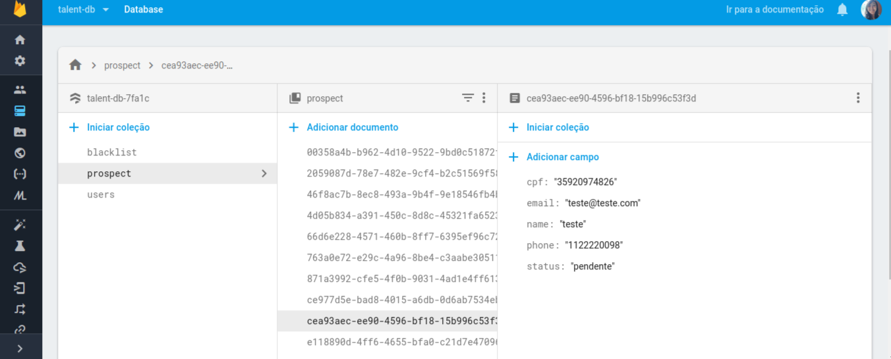
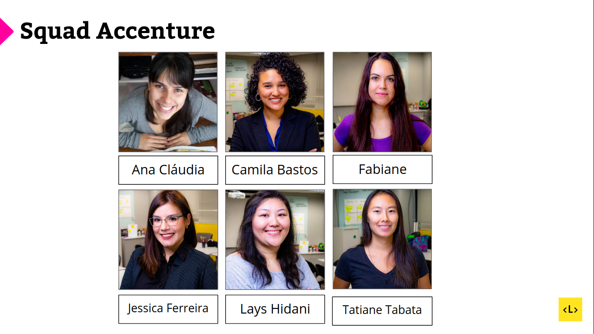

# Talent Fest HackaThon
​
## Desafio Accenture
​
Construir uma aplicação para que o cliente final possa abrir sua conta corrente em
uma instituição financeira, sem auxílio do gerente do banco.
O fluxo de cadastro do cliente deve possuir de 3 a 5 telas (no máximo).
Adicionalmente ao cadastro deverá haver uma tela que servirá para que o banco faça
a validação das solicitações de abertura de conta corrente. Esta tela deve permitir
listar e buscar solicitações, além de cancelar uma solicitação.
O frontend deve ser uma SPA (single page application) em React, com
backend/database nas tecnologias escolhidas pelo grupo.

## Critério de avaliação:
* Usabilidade
  * Naturalidade no fluxo de captura de informações e facilidade no uso;
  * Padrão visual (ícones, cores, fontes e elementos visuais)
  * Responsividade da aplicação;
  * Mensagens de auxílio para informações imputadas erroneamente
* Validação dos dados imputados (CPF, telefone, etc)
* Persistência das informações e contas criadas

### Desafios Adicionais:
* Criação de uma da tela no fluxo de cadastro para captura de imagem de documentos (ex. CNH, CPF e RG) através da câmera do celular ou upload;
* Uso de gerenciador de estado (ex: Redux, MobX);
* Proteger a tela de listagem com login;
* Relatório de performance (LightHouse);

## Solução: XBANK

[Link da aplicação](https://talent-db-7fa1c.firebaseapp.com/)

Para construção da aplicação foram utilizadas as seguintes tecnologias:

* Reactjs
* Firebase: autenticação, persistência dos dados e hosting
* Bootstrap

#### RoadMap
##### v1.0.0 (released)
*Cliente:*
* Coleta e validadação de CPF em formato de *string* ou *number* (com mensagem de erro para input inválido) - [acessar](https://talent-db-7fa1c.firebaseapp.com/)
  * Validação via [biblioteca](https://www.npmjs.com/package/gtech-cpf-validator) própria desenvolvida em projeto anterior
* Tratamento de input do CPF (salva no banco de dados somente os números sem caracteres especiais)
* Coleta e validadação de nome, email, telefone (com mensagem de erro para input inválido) - [acessar](https://talent-db-7fa1c.firebaseapp.com/customer-data)
* Tela de confirmação (dados encaminhados para análise do banco) - [acessar](https://talent-db-7fa1c.firebaseapp.com/confirmation)

*Gerente:*
* Proteger a tela de listagem com login (com autenticação) - [acessar](https://talent-db-7fa1c.firebaseapp.com/login)
    
    **Dados para acesso:**
    * email: admin@mail.com
    * senha: 
* Banco de dados coletados do cliente (firebase) completo
* Tela de listagem (parcialmente implementada) - [acessar](https://talent-db-7fa1c.firebaseapp.com/admin-dashboard)

##### v2.0.0
*Cliente:*
* Captura de imagem de documentos (ex. CNH, CPF e RG) através da câmera do celular ou upload (API);
* Reconhecimento facial em documentos enviados (API)
* Implementação de blacklist e filtro (banco de dados)
* Implementação de SCORE (API)
* Inputar endereço automaticamente (API - GPS)

*Gerente:*
* Listagem de solicitações 
* Filtros de busca de solicitações (status)
* Campo de busca de solicitações por dado (CPF, nome)
* Cancelar solicitação

## Equipe

* [Ana Cláudia Camargo](https://github.com/anacamargo)
* [Camila Bastos](https://github.com/camebastos)
* [Fabiane Albuquerque](https://github.com/faalbuquerque)
* [Jéssica Ferreira](https://github.com/jayferreira)
* [Lays Hidani](https://github.com/layshidani)
* [Tatiane Tabata](https://github.com/TatianeTabata)
